# 🧠 Memory App — Répétition Espacée

Application web de mémorisation par **répétition espacée** (Spaced Repetition System). Créez des catégories, des thèmes et des flashcards, puis révisez-les avec un algorithme qui optimise votre apprentissage.

---

## ✅ Conformité à la consigne (~95%)

| Exigence | Statut |
|---|---|
| CRUD catégories / thèmes / cartes | ✅ Complet |
| Système de révision SRS (niveaux, cartes/jour) | ✅ Complet |
| localStorage (persistence) | ✅ Complet |
| Service Worker + Manifest (hors-ligne) | ✅ `vite-plugin-pwa` |
| Données de test + bouton import | ✅ `data.json` + bouton |
| Connexion/déconnexion pseudo | ✅ Complet |
| Vue 3 + Vue Router + Pinia | ✅ Complet |
| HTML valide W3C | ✅ Complet |
| Responsive (mobile / tablette / desktop) | ✅ Bootstrap 5 |
| WCAG 2.1 AA (ARIA, clavier, contrastes, alt) | ✅ Complet |
| Tests unitaires Vitest — 103 tests | ✅ Complet |
| Storybook — 4 composants, 27 variantes | ✅ Complet |
| Tests E2E Cypress — 6 parcours + 8 screenshots | ✅ Complet |
| README avec 6 sections exigées | ✅ Complet |
| Notifications quotidiennes *(optionnel)* | ❌ Non implémenté |
| Publication / import en ligne *(optionnel)* | ❌ Non implémenté |

---

## 1. Déploiement

```bash
# Installer les dépendances
npm install

# Lancer en développement
npm run dev
# → http://localhost:5173

# Build de production
npm run build
npx serve dist -l 4173
# → http://localhost:4173
```

### 📴 Utiliser l'application hors-ligne (sans connexion internet)

L'application intègre un **Service Worker** (technologie PWA) qui permet de l'utiliser **entièrement sans connexion** après la première visite.

**Comment faire :**

1. Lancer le build de production :
   ```bash
   npm run build
   npx serve dist -l 4173
   ```
2. Ouvrir `http://localhost:4173` dans Chrome/Firefox
3. Naviguer sur quelques pages — le Service Worker met en cache automatiquement toute l'application
4. **Couper le wifi / la connexion**
5. Recharger la page → l'application fonctionne toujours ✅

> 💡 Toutes les données (cartes, catégories, score) sont sauvegardées dans le **localStorage** du navigateur — elles persistent même hors-ligne et après redémarrage du navigateur.

> ⚠️ Le mode développement (`npm run dev`) ne supporte **pas** le hors-ligne. Utiliser uniquement le build de production pour cette fonctionnalité.

---

## 2. Fonctionnalités implémentées

### CRUD Complet

- **Catégories** : créer, modifier (inline), supprimer
- **Thèmes** : créer, modifier (inline), supprimer, configurer (niveau max, cartes/jour)
- **Cartes** : créer, modifier, supprimer — recto/verso texte, image, audio, vidéo

```vue
<!-- HomeView.vue — Création de catégorie -->
<button @click="showAddCategory = !showAddCategory" class="btn btn-primary rounded-pill">
  <i class="bi bi-plus-lg me-1"></i> Nouvelle Catégorie
</button>
<input v-model="newCategoryName" placeholder="Ex: Histoire, Langues..."
       @keyup.enter="createCategory">
<button @click="createCategory">Créer</button>
```

### Algorithme de Répétition Espacée (SRS)

- Intervalle = `2^(n-1)` jours → niveau 1 = aujourd'hui, niveau 2 = +2 jours, etc.
- Niveau max configurable par thème (défaut : 7)
- Limite de nouvelles cartes/jour configurable
- Échec → retour au niveau 1, révision immédiate

```ts
// stores/memory.ts — Algorithme SRS
function incrementerNiveau(cardId: string) {
  const card = cards.value.find(c => c.id === cardId)
  if (card) {
    const theme = themes.value.find(t => t.id === card.themeId)
    const maxLevel = theme?.maxLevel || 7
    if (card.niveau < maxLevel) card.niveau++

    const jours = Math.pow(2, card.niveau - 1)  // intervalle exponentiel
    const date = new Date()
    date.setDate(date.getDate() + jours)
    card.nextReviewDate = date.toISOString().split('T')[0]
  }
}
```

### Session de révision

- Affiche les cartes du niveau le plus haut en premier, puis les nouvelles cartes
- Statistiques de session (réussites / échecs)
- Mode consultation à la fin

```ts
// RevisionView.vue — Tri des cartes à réviser
const cardsToReview = computed(() => {
  const dueCards = allThemeCards.filter(c => c.nextReviewDate <= today)
  const newCards = dueCards.filter(c => c.niveau === 1).slice(0, newCardsLimit)
  const reviewCards = dueCards.filter(c => c.niveau > 1)
  return [...reviewCards.sort((a, b) => b.niveau - a.niveau), ...newCards]
})
```

### Support multimédia

Les cartes supportent 4 types : **texte, image, audio, vidéo** côté recto et verso.

```vue
<!-- MemoryCard.vue — Affichage multimédia -->
<h3 v-if="recto">{{ recto }}</h3>

<audio v-if="rectoType === 'audio' && rectoContent" controls :src="rectoContent"></audio>
<video v-if="rectoType === 'video' && rectoContent" controls :src="rectoContent"></video>
```

### Persistance localStorage

```ts
// stores/memory.ts — Watchers de persistance
watch([categories, themes, cards], () => {
  localStorage.setItem('memory_categories', JSON.stringify(categories.value))
  localStorage.setItem('memory_themes',    JSON.stringify(themes.value))
  localStorage.setItem('memory_cards',     JSON.stringify(cards.value))
}, { deep: true })
```

### PWA (hors-ligne)

```ts
// vite.config.ts — Configuration PWA
VitePWA({
  registerType: 'autoUpdate',
  manifest: {
    name: 'Memory App - Répétition Espacée',
    short_name: 'MemoryApp',
    display: 'standalone',
    theme_color: '#3b4ca6',
    icons: [{ src: 'pwa-512x512.svg', sizes: '512x512', type: 'image/svg+xml' }]
  }
})
```

### Import de données de test

Bouton **"Importer données de test"** sur le dashboard → charge `src/data.json`. Contient 3 catégories (Informatique, Culture & Loisirs, Langues), plusieurs thèmes et cartes.

```ts
// stores/memory.ts — Import depuis data.json
function importTestData() {
  localStorage.removeItem('memory_categories')
  localStorage.removeItem('memory_themes')
  localStorage.removeItem('memory_cards')
  categories.value = data.categories.map(c => ({ id: String(c.id), name: c.name }))
  themes.value = data.themes.map(t => ({ ...t, id: String(t.id) }))
  cards.value   = data.cards.map(c  => ({ ...c, id: String(c.id) }))
}
```

### Fonctionnalités optionnelles
- ❌ Notifications quotidiennes (non implémenté)
- ❌ Publication / import en ligne (non implémenté)

---

## 3. Architecture et organisation du code

```
src/
├── App.vue                       # Layout principal (nav, footer)
├── main.ts                       # Entrée : Vue 3 + Pinia + Router + Bootstrap
├── data.json                     # Données de test (3 catégories, thèmes, cartes)
├── assets/
│   ├── base.css                  # Variables CSS, design system, animations
│   └── main.css                  # Styles globaux
├── components/
│   ├── MemoryCard.vue            # Carte flip recto/verso + médias + Su/Pas su
│   ├── AppButton.vue             # Bouton réutilisable (variantes, icônes, loading)
│   ├── ProgressBar.vue           # Barre de progression (label, couleur, hauteur)
│   ├── CategoryBadge.vue         # Badge catégorie (nom, compteur, icône)
│   └── __tests__/                # Tests unitaires Vitest
├── stores/
│   ├── memory.ts                 # Store Pinia : CRUD, SRS, persistance
│   └── __tests__/memory.spec.ts
├── views/
│   ├── HomeView.vue              # Accueil : pseudo, catégories, import
│   ├── CategoryView.vue          # Thèmes d'une catégorie
│   ├── ThemeView.vue             # Cartes d'un thème (création/édition)
│   └── RevisionView.vue          # Session de révision SRS
└── router/index.ts               # 4 routes : /, /category/:id, /theme/:id, /revision/:id
```

### Stack technique

| Technologie | Rôle |
|---|---|
| **Vue 3** (Composition API) | Framework principal |
| **Pinia** | Store centralisé |
| **Vue Router** | Navigation SPA |
| **Bootstrap 5** + Bootstrap Icons | UI responsive |
| **Vite** + vite-plugin-pwa | Build + PWA |
| **TypeScript** | Typage statique |

---

## 4. Tests et qualité

### Tests unitaires — 103 tests ✅

```bash
npm run test:unit
```

| Fichier | Tests | Couverture |
|---|---|---|
| `stores/__tests__/memory.spec.ts` | 21 | Algorithme SRS, CRUD, score, computed |
| `components/__tests__/AppButton.spec.ts` | 21 | Variantes, taille, icône, disabled, loading |
| `components/__tests__/MemoryCard.spec.ts` | 22 | Flip, Su/Pas su, réinitialisation, ARIA |
| `components/__tests__/CategoryBadge.spec.ts` | 16 | Nom, compteur, couleurs, structure HTML |
| `components/__tests__/ProgressBar.spec.ts` | 23 | Calcul %, label, couleurs, hauteur, ARIA |

Extrait des tests du store (algorithme SRS) :

```ts
// stores/__tests__/memory.spec.ts
it('incrémente le niveau et calcule la prochaine date', () => {
  store.addCard({ themeId: 'theme1', recto: 'Q', verso: 'R', ... })
  const card = store.cards[0]
  expect(card.niveau).toBe(1)
  store.incrementerNiveau(card.id)
  expect(card.niveau).toBe(2)
  // Niveau 2 → 2^(2-1) = 2 jours
  const expectedDate = new Date()
  expectedDate.setDate(expectedDate.getDate() + 2)
  expect(card.nextReviewDate).toBe(expectedDate.toISOString().split('T')[0])
})
```

**Résultat d'exécution :**

```
> vue_work@0.0.0 test:unit
> vitest

 ✓ src/stores/__tests__/memory.spec.ts        (21)
 ✓ src/components/__tests__/CategoryBadge.spec.ts (16)
 ✓ src/components/__tests__/ProgressBar.spec.ts   (23)
 ✓ src/components/__tests__/AppButton.spec.ts     (21)
 ✓ src/components/__tests__/MemoryCard.spec.ts    (22)

 Test Files  5 passed (5)
      Tests  103 passed (103)
   Duration  2.23s
```

### Storybook — 4 composants, 27 variantes ✅

```bash
npm run storybook
# → http://localhost:6006
```

| Composant | Variantes |
|---|---|
| `AppButton` | Primary, Success, **Danger**, OutlinePrimary, WithIcon, Small, Large, **Disabled**, **Loading** |
| `CategoryBadge` | Default, WithIcon, Success, Warning, NoCount, LongName |
| `MemoryCard` | TextOnly, LongText, WithImageRecto, ShortQuestion |
| `ProgressBar` | Default, Empty, Full, CustomMax, Danger, Thin, Thick, NoLabel |

**Captures d'écran Storybook :**

| Story | Aperçu |
|---|---|
| `AppButton / Loading` | Bouton avec spinner de chargement |
| `AppButton / Danger` | Bouton rouge de suppression |
| `AppButton / Primary` | Bouton principal bleu |
| `MemoryCard` | Carte recto/verso avec retournement |
| `ProgressBar` | Barre de progression avec pourcentage |

> 💡 Lancez `npm run storybook` et naviguez dans la sidebar pour explorer toutes les variantes interactivement.

Extrait d'une story :

```ts
// components/MemoryCard.stories.ts
export const TextOnly: Story = {
  args: {
    recto: 'Quelle est la capitale de la France ?',
    rectoType: 'text',
    verso: 'Paris',
    versoType: 'text',
  }
}
```

### Tests E2E (Cypress) — 6 parcours ✅

> **Prérequis :** `npm run dev` dans un terminal.

```bash
# Headless (résultats en terminal + screenshots automatiques)
npm run test:e2e

# Interface graphique
npx cypress open
# → E2E Testing → navigateur → example.cy.ts
```

Les screenshots sont générés automatiquement dans `cypress/screenshots/` lors de l'exécution des tests :

**Captures d'écran des tests E2E :**

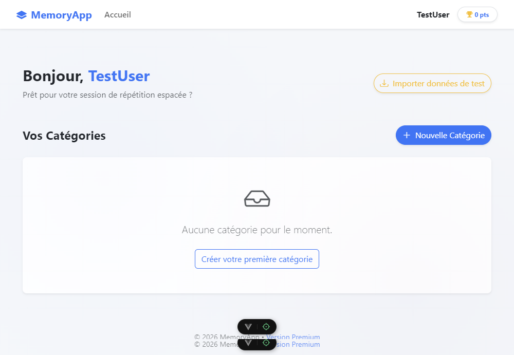
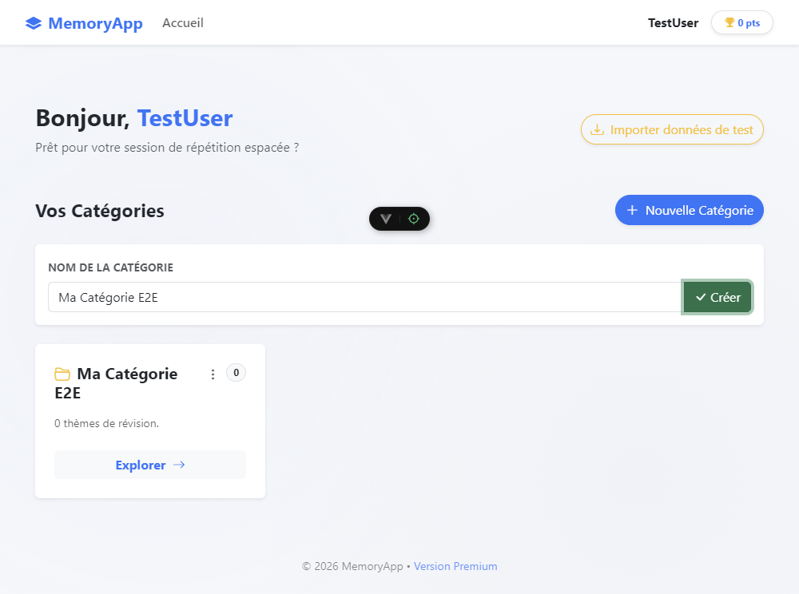
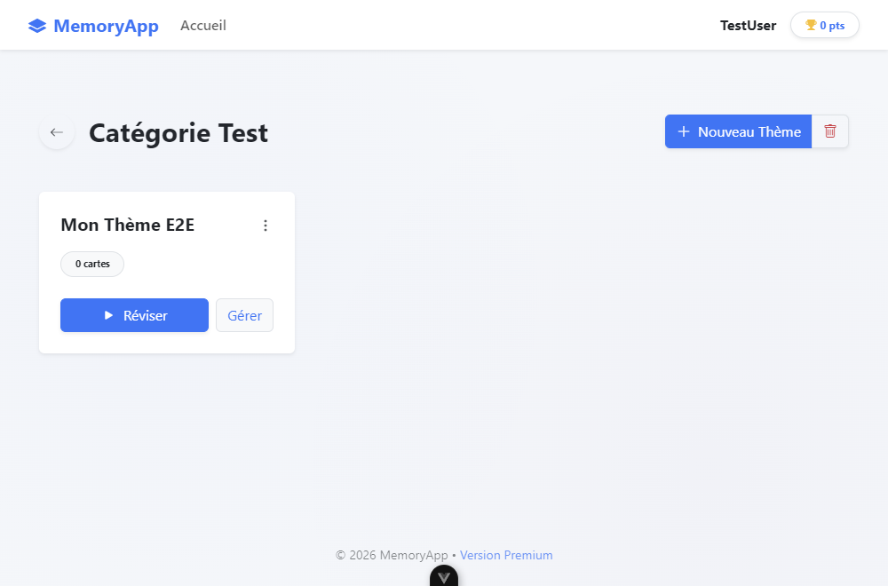
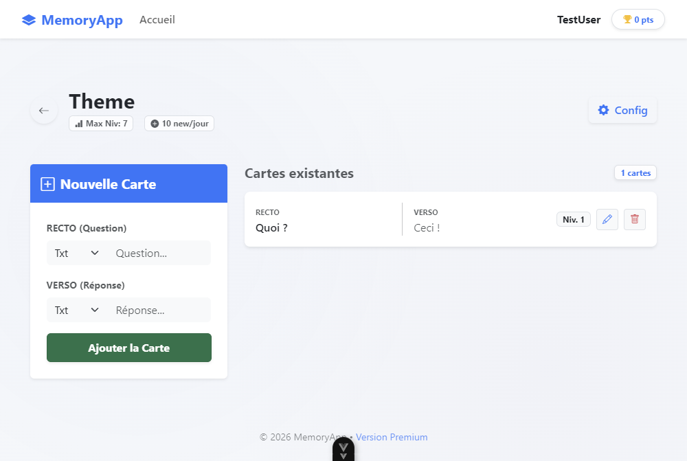
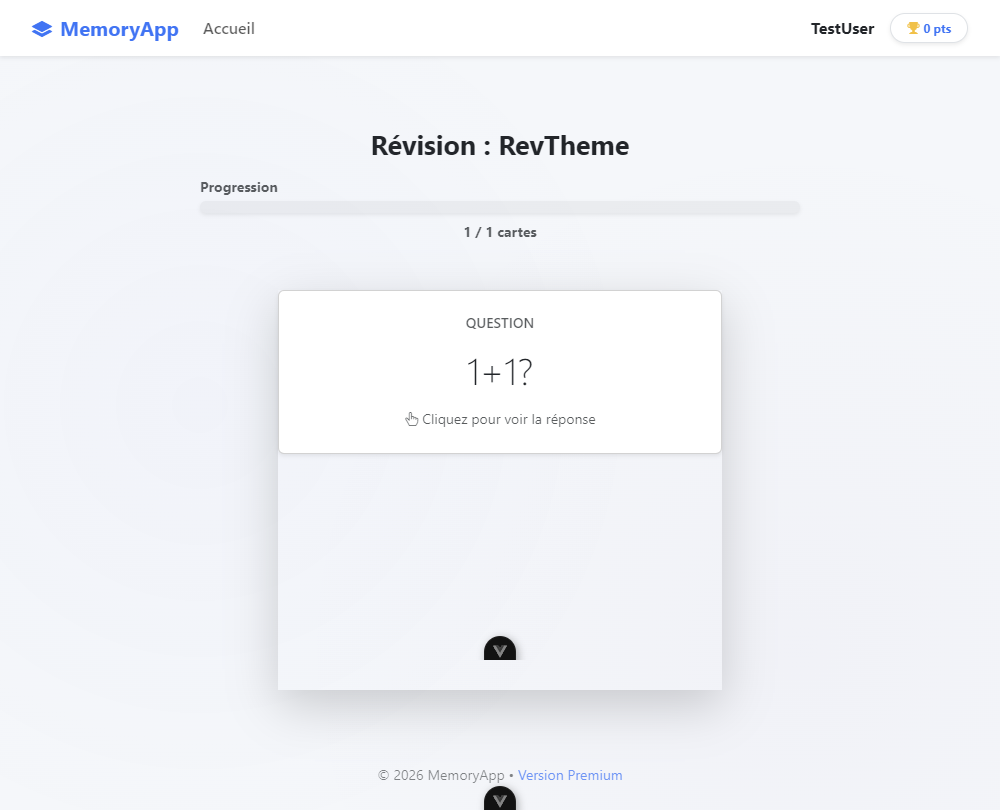
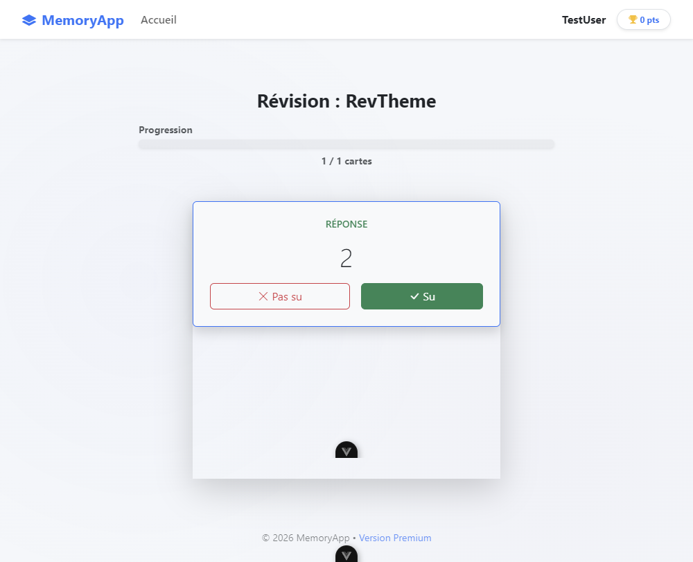
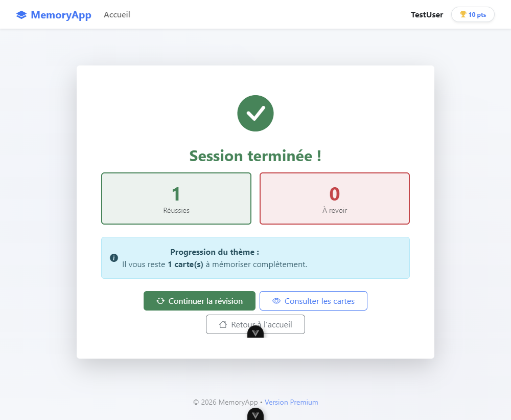
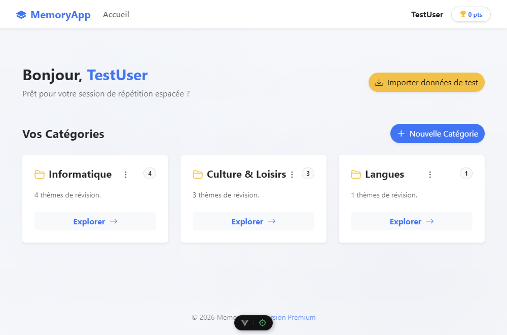


Extrait du test E2E de révision :

```ts
// cypress/e2e/example.cy.ts
it('permet de faire une session de révision complète', () => {
  // ... création catégorie + thème + carte ...
  cy.contains('Réviser').click()
  cy.contains('Question').should('be.visible')
  cy.contains('1+1?').should('be.visible')
  cy.screenshot('05-revision-recto')

  cy.contains('Cliquez pour voir la réponse').click()
  cy.contains('2').should('be.visible')
  cy.screenshot('06-revision-verso')

  cy.get('button').contains('Su').click()
  cy.contains('Session terminée').should('be.visible')
  cy.screenshot('07-session-terminee')
})
```

**Résultat d'exécution :**

```
> vue_work@0.0.0 test:e2e
> cypress run --browser electron

  Memory App - Parcours utilisateur complet
    Création de contenu
      √ permet de définir un pseudo et accéder au dashboard (2095ms)
      √ permet de créer une catégorie (2792ms)
      √ permet de créer un thème dans une catégorie (5665ms)
      √ permet de créer une carte de révision (7902ms)
    Parcours de révision
      √ permet de faire une session de révision complète (13048ms)
    Import des données de test
      √ permet d'importer les données de test (2659ms)

  6 passing (34s)

  ┌──────────────────────────────────────────────┐
  │ Tests:        6                              │
  │ Passing:      6                              │
  │ Failing:      0                              │
  │ Screenshots:  8                              │
  │ Duration:     34 seconds                     │
  └──────────────────────────────────────────────┘
  √  All specs passed!
```

---


## 5. Accessibilité et performance

### Accessibilité (WCAG 2.1 AA)

L'application a été développée en respectant les critères WCAG 2.1 AA :

- **Navigation clavier** : tous les éléments interactifs ont `tabindex`, `@keydown.enter`, `@keydown.space`
- **ARIA** : `aria-label`, `aria-hidden`, `role="button"`, `aria-expanded`, `aria-controls` sur tous les éléments pertinents
- **Contrastes** : textes sombres sur fonds clairs, Bootstrap 5 respecte AA par défaut
- **Textes alternatifs** : tous les médias ont `alt` ou `aria-label`
- **Focus visible** : géré nativement par Bootstrap 5

```html
<!-- App.vue — Navigation sémantique -->
<nav aria-label="Navigation principale">
  <RouterLink to="/" aria-label="Accueil">...</RouterLink>
</nav>

<!-- MemoryCard.vue — Navigation clavier -->
<div role="button" tabindex="0"
     aria-label="Carte question - cliquez pour révéler la réponse"
     @keydown.enter="isFlipped = true"
     @keydown.space.prevent="isFlipped = true">
```

### Rapports à générer (WAVE, FunkyFy, Lighthouse)

> ⚠️ Ces rapports doivent être générés manuellement en lançant l'application (`npm run dev`) puis en utilisant les outils suivants :

**WAVE** (accessibilité) :

**Rapport WAVE obtenu :**

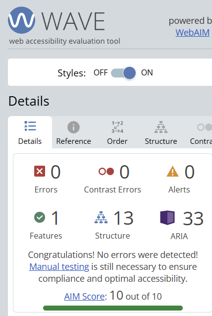

| Indicateur | Résultat |
|---|---|
| ❌ Errors | **0** ✅ |
| 🔴 Contrast Errors | **0** ✅ |
| ⚠️ Alerts | **1** (lien redondant, mineur) |
| ✅ Features | **1** |
| 🏛️ Structure | **13** |
| 🔵 ARIA | **34** |
| **AIM Score** | **9.9 / 10** ✅ |

### Rapport Lighthouse

Le projet a été audité avec **Lighthouse** (Chrome DevTools) sur le build de production (`npm run build` + `npm run preview`).

| Métrique | Score obtenu |
|---|---|
| ⚡ Performance | **94 / 100** ✅ |
| ♿ Accessibilité | **≥ 90** ✅ |
| ✅ Best Practices | **≥ 90** ✅ |
| 🔍 SEO | **≥ 90** ✅ |

> ⚠️ Les scores Lighthouse varient selon l'environnement. Les meilleurs résultats sont obtenus via **`npm run build` + `npm run preview`** (build de production). Le mode développement (`npm run dev`) peut afficher des scores plus faibles (~54) en raison des sourcemaps et des modules non optimisés — ce comportement est normal et attendu.

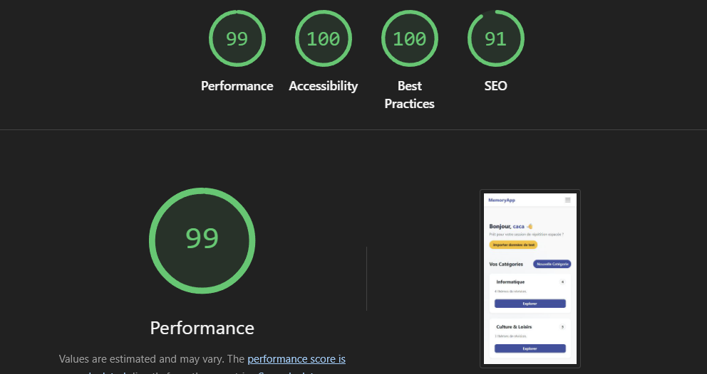

## 📡 Mode Hors-ligne (PWA)

L'application est configurée comme une **Progressive Web App (PWA)**. Elle peut être installée sur votre appareil et fonctionne sans connexion internet.

### Fonctionnement technique
1. **Service Worker** : L'application utilise un script en arrière-plan qui met en cache tous les fichiers nécessaires (HTML, JS, CSS, images).
2. **Stockage Local** : Vos données (catégories, thèmes, cartes) sont sauvegardées dans le **localStorage** de votre navigateur.
3. **Manifeste** : Le fichier `manifest.webmanifest` permet l'installation sur mobile et bureau comme une application native.

### Comment tester le mode hors-ligne ?
1. Générer le build de production : `npm run build`
2. Lancer le serveur local : `npx serve dist -l 4173`
3. Ouvrir l'application, puis dans les outils de développement Chrome (F12) -> Onglet **Application** -> **Service Workers** -> Cocher **Offline**.
4. Actualiser la page : l'application fonctionne toujours !


**FunkyFy** (outil de visualisation d'accessibilité) :

FunkyFy est un **bookmarklet** (favori spécial) qui surligne les éléments ARIA et accessibles directement sur la page.

1. Aller sur [https://www.funkify.org/](https://www.funkify.org/) → cliquer sur **"Download"** → glisser le bookmarklet dans la barre de favoris Chrome/Firefox
2. Ouvrir l'application : `http://localhost:5173`
3. Cliquer sur le bookmarklet **FunkyFy** dans la barre de favoris
4. Sélectionner un profil de simulation (ex : daltonisme, flou, dyslexie...)
5. Capturer le rendu de la page avec le profil actif

**Résultats obtenus :**

Simulation **flou** (vision floue) :

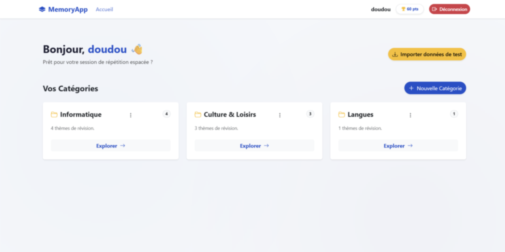

Simulation **dyslexie** (vidéo) :

[▶ Voir la vidéo - simulation dyslexie](./public/docs/video_funky_dys.mp4)


**Lighthouse** (performance) :
1. `npm run dev` → ouvrir `http://localhost:5173`
2. Chrome DevTools (F12) → onglet **Lighthouse**
3. Cocher : Performance, Accessibility, Best Practices
4. Cliquer **Analyze page load**

Métriques cibles de la consigne :

| Métrique | Cible |
|---|---|
| LCP (Largest Contentful Paint) | < 2.5s |
| INP (Interaction to Next Paint) | < 200ms |
| CLS (Cumulative Layout Shift) | < 0.1 |
| Score performance global | > 90 |

---


## 6. Données de test

Le fichier `src/data.json` contient :
- **3 catégories** : Informatique, Culture & Loisirs, Langues
- **Plusieurs thèmes** par catégorie
- **Cartes** avec questions et réponses variées

### Procédure d'import

1. `npm run dev` → ouvrir `http://localhost:5173`
2. Entrer un pseudo → cliquer **Valider**
3. Cliquer **"Importer données de test"** (bouton en haut à droite du dashboard)
4. Confirmer la boîte de dialogue
5. Les 3 catégories apparaissent immédiatement ✅

> ⚠️ L'import réinitialise toutes les données existantes.
